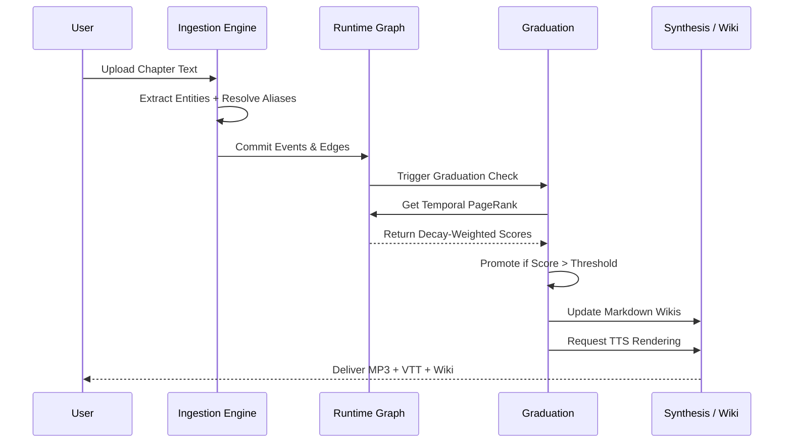

# 🚂 Pipeline Walkthrough

The end-to-end pipeline transforms a raw text file into a living knowledge graph and an immersive, multi-voice audiobook. The sequence is governed by a strict state machine to ensure data consistency.

---

## The Four Stages

### 1. "The Eye" (Ingestion & Extraction)
**Goal:** Parse unstructured text into structured events.
- Text is ingested via RoyalRoad scrapers, EPUB parsers, or raw text input.
- An LLM (via `litellm`) analyzes chunks and identifies Character Entities and narrative Events.
- **Alias Resolution:** Discovers variations of names (e.g., "The Sect Leader", "Leader Li", "Li") and consolidates them into a single canonical ID to prevent graph fragmentation.

### 2. "The Brain" (Dynamic Graph Update)
**Goal:** Commit events to long-term memory.
- The new `Dynamic Event Units (DEUs)` are inserted into the NetworkX Directed Graph.
- Bidirectional weighted edges are formed between the Event and the participating Characters.
- The graph is immediately serialized to `story_graph.json` to persist state across sessions.

### 3. "The Director" (Graduation & Reasoning)
**Goal:** Mathematically determine who matters.
- Runs the **Temporal Decay PageRank** algorithm on the whole graph.
- Calculates the **Debut Prominence Quotient (DPQ)** for characters appearing in the current chapter.
- Characters exceeding the `MAIN_CAST_THRESHOLD` (5.0) are "Graduated".
- Graduated characters are permanently assigned a premium TTS Voice ID from the local `VoiceRegistry`.

### 4. "The Voice & Memory" (Synthesis & Output)
**Goal:** Generate user-facing artifacts.
- **Wiki:** The character's markdown profile is generated/updated with the new chapter's synopsis and traits.
- **Audiobook:** 
  - The chapter is chunked and analyzed by the LLM to separate Narrator prose from Character Dialogue (this `cached_script.json` is saved to prevent re-running expensive API calls).
  - Dialogue lines from Graduated characters are rendered using high-quality local **Kokoro ONNX**.
  - All other lines (and Narrator) are rendered using fallback **EdgeTTS**.
  - Audio segments are stitched together with `pydub`, and a synchronized `.vtt` subtitle file is generated.

---

## Sequence Diagram

---

*→ Next: [Graduation Algorithm](Graduation-Algorithm)*
