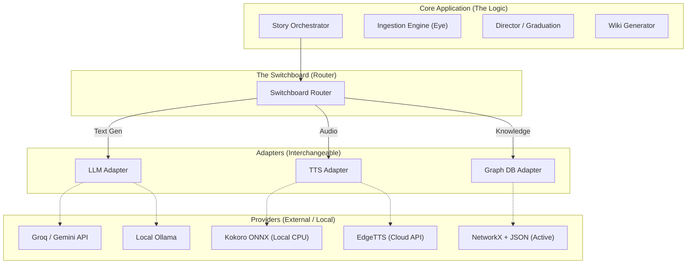

# 🧠 System Architecture

Webnovel Architect implements a **Neuro-Symbolic Switchboard Architecture** combined with a **DyG-RAG (Dynamic Graph RAG)** reasoning engine. This approach formally decouples "Contextual Extraction" (Neural) from "Temporal Reasoning" (Symbolic).

---

## 1. The Core Philosophy

Most LLM-based tools rely entirely on neural context windows to track story state. This fails for webnovels because:
1. **Context limits:** Million-word serials cannot fit in standard windows.
2. **Temporal hallucination:** Static Vector RAG retrieves events out-of-order, causing the model to think dead characters are still alive because their past scenes score high in semantic similarity.

**Our Solution:** The LLM is used *only* as an extraction engine ("The Eye"). It converts raw text into structured `Dynamic Event Units (DEUs)`. These events are then permanently stored in a deterministic, chronological Directed Graph ("The Brain"). All character importance reasoning is done purely mathematically on this graph ("The Director").

---

## 2. The Switchboard Router

To guarantee that the project can run on a consumer laptop (Zero-GPU footprint) while scaling to cloud environments or research labs, all heavy components are hidden behind the Switchboard.

By altering `config.yaml`, you can hot-swap `groq` for `ollama`, or `kokoro` for `edge-tts`, without touching any core logic.

---

## 3. Data Model (DyG-RAG)

The knowledge graph is a Directed Graph (DiGraph) utilizing NetworkX.

### Nodes
- **Character Nodes:** Store ongoing traits, aliases, and the last chapter they were seen in.
- **Event Nodes:** Represent a single discrete narrative beat (usually 1 per chunk/scene).

### Edges
- **`participant` (Character → Event):** Has a weight of 1-5 indicating narrative intensity.
- **`featured` (Event → Character):** Bidirectional link to allow PageRank to flow backwards from central events to the characters involved.

---

*→ Next: [Pipeline Walkthrough](Pipeline-Walkthrough)*
