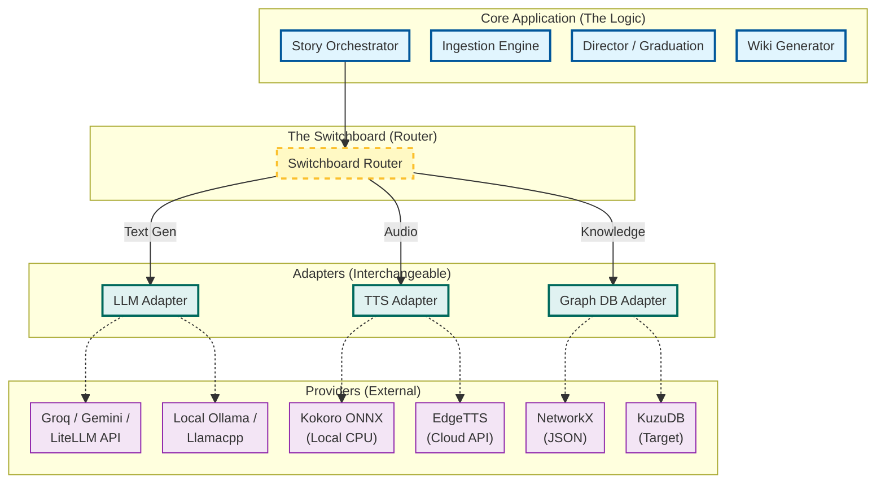
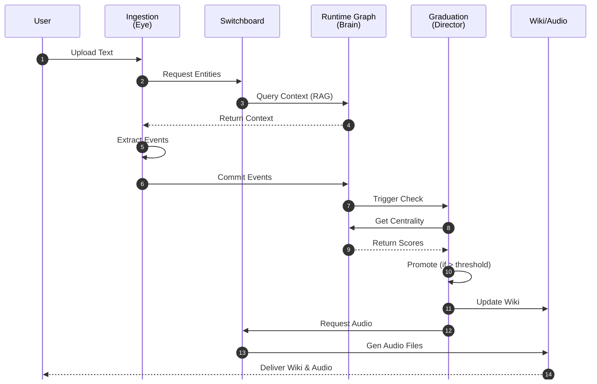

# Architecture and Design

## System Architecture & High-Level Design


### 1. Architectural Overview

Webnovel Architect is designed as a **layered neuro-symbolic pipeline** that transforms unstructured narrative text into a persistent, queryable knowledge representation and canonical outputs.

The architecture follows an **Event-Centric DyG-RAG (Dynamic Graph Retrieval-Augmented Generation)** model in which:

- Neural components perform extraction and interpretation.
    
- Symbolic components maintain long-term structured memory.
    
- Retrieval mechanisms ensure consistency across evolving narrative context.
    

**Top-Level Flow**

```
Raw Narrative Text
    ↓
Ingestion & Entity Extraction ("Eye")
    ↓
Event Construction Layer
    ↓
Dynamic Event Graph Runtime ("Brain")
    ↓
Reasoning & Character Graduation ("Director")
    ↓
Knowledge Outputs ("Memory" + "Voice")
```

---

### 2. Core Architectural Principles

1. **Event-Centric Representation**
    
    - Narrative state is encoded as events, not mention counts.
        
2. **Persistent Canonical Memory**
    
    - All validated information is stored in a graph database.
        
3. **Neuro-Symbolic Hybridization**
    
    - Neural NLP performs perception.
        
    - Symbolic graph performs reasoning.
        
4. **Traceability**
    
    - Every output can be traced back to specific source text and events.
        
5. **Tiered Deployability**
    
    - System can operate across multiple hardware profiles.
        

---

### 3. Major System Components

#### 3.1 Ingestion Engine (“Eye”)

**Purpose**

- Convert raw narrative text into structured entities and candidate events.
    

**Inputs**

- Chapter text or document
    

**Outputs**

- Entities (characters, locations, objects)
    
- Preliminary event representations
    

**Current Implementation**

- **LiteLLM** (Groq default, Gemini Flash fallback) based structured extraction.
- **spaCy** local NER pipeline variant for fallback parsing.
- **Alias Resolution** module that normalizes distinct references (e.g., "Aria", "the girl") into unified IDs.
- **Fiction Scrapers:** Multi-provider support (starting with RoyalRoad) with Fiction Index URL parsing.
- **EPUB Parser:** Direct chapter extraction from .epub binaries.
- Validated via `tests/test_scrapers.py`.
    

**Target Implementation**

- Direct LLM-based Event relationship extraction (Causal mapping)
    

**Key Responsibilities**

- Tokenization
    
- Named entity recognition
    
- Context-aware linking
    

---

#### 3.2 Event Construction Layer

**Purpose**

- Convert extracted information into formal event objects suitable for graph insertion.
    

**Event Schema (Conceptual)**

```
Event:
    event_id
    timestamp / narrative order
    actors
    action
    location
    relationships
    source_text_reference
```

**Outputs**

- Structured event instances
    

---

#### 3.3 Story Runtime (“Brain”) — Dynamic Event Graph (DyG-RAG)

**Purpose**

- Maintain persistent story knowledge.
    
- Represent relationships across time.
    

**Technology Options**

- **NetworkX** (Current verified implementation)
- KuzuDB (Target for >10k events)
- Neo4j (Alternative for visualization)
    

**Graph Model**

**Nodes**

- Character
    
- Event
    
- Location
    
- Artifact
    

**Edges**

- ACTED_IN
    
- CAUSED_BY
    
- RELATED_TO
    
- OCCURRED_AT
    

**Functions**

- Insert events dynamically
    
- Maintain evolving relationships
    
- Support query and retrieval
    

---

#### 3.4 Reasoning & Graduation System (“Director”)

**Purpose**

- Determine narrative importance of entities.
    

**Current Logic**

- **Weighted PageRank Centrality** integrated with **Temporal Decay**.
- **Debut Prominence Quotient (DPQ)**: Bootstraps new characters based on 1-chapter sub-graph dominance.
- Threshold-based Voice Locking (`MAIN_CAST` threshold > 0.50).
    

**Target Logic**

- Graph-based centrality metrics:
    
    - PageRank
        
    - Degree centrality
        

**Outputs**

- Character classification:
    
    - Background
        
    - Supporting
        
    - Main cast
        

---

#### 3.5 Knowledge Memory Layer (“Wiki Generator”)

**Purpose**

- Produce canonical, human-readable knowledge artifacts.
    

**Outputs**

- Markdown wiki pages
    
- Character summaries
    
- Relationship tables
    

**Design Decision**

- Markdown retained as canonical, version-controlled memory.
    

---

#### 3.6 Voice Synthesis Layer (“Audio”)

**Purpose**

- Assign and generate character voice output.
    

**Planned Implementations**

- Research Tier: StyleTTS2
    
- Laptop Tier: Piper
    
- Zero-GPU Tier: Edge-TTS
    

**Status**

- ✅ **Implemented.** Supports local Kokoro and cloud Edge-TTS. 
- Includes an **Audiobook Generator Pipeline** that chunks chapters, uses LLMs (with fallback and caching) to extract Narrator/Dialogue scripts, and stitches audio dynamically.
- Includes **Synchronized VTT generation** for on-screen text highlighting during playback.
    

---

### 4. Data Flow Description

1. Text is ingested.
    
2. Entities and candidate events are extracted.
    
3. Events are normalized and structured.
    
4. Events are inserted into the dynamic graph.
    
5. Graph metrics update character importance.
    
6. Wiki pages and optional audio are generated.
    

---

### 5. Deployment Tier Strategy

|Tier|Extraction|Runtime|Audio|
|---|---|---|---|
|Research Lab|xCoRe|Graph DB|StyleTTS2|
|Laptop|spaCy|Graph DB|Piper|
|Zero-GPU|API|KuzuDB|Edge-TTS|

---

### 6. Non-Functional Requirements

- Reproducibility of results
    
- Persistence of narrative state
    
- Modular extensibility
    
- Hardware adaptability
    
- Transparent reasoning trace
    

---

### 7. Known Architectural Risks

- Complexity of event extraction accuracy
    
- Graph schema evolution over time
    
- Performance with very large narratives
    
- Integration overhead between neural and symbolic layers
    

---

### 8. Architecture Governance Rule

- All major design changes must update this document.
    
- Implementation must not diverge from documented interfaces.
    

---

When ready, say **“next”** and I will provide **Document 3 — Current State Report (Implementation Status & Gap Analysis)**.

---

## Detailed_Architecture_and_Pipeline


## 1. Executive Summary

The **Webnovel Architect** is a **Neuro-Symbolic Story Intelligence System** designed to function on consumer hardware ("Zero-GPU"). It evolves static text into a living, queryable world.

The system relies on two core architectural innovations:
1.  **The Switchboard Pattern (Zero-GPU Architecture):** A modular adapter system that allows heavy AI components (LLM, TTS, Database) to be swapped based on available hardware (e.g., swapping OpenAI API for a local quantized Llama model).
2.  **DyG-RAG (Dynamic Graph RAG):** A narrative memory system that builds a knowledge graph *as the story progresses* using **Dynamic Event Units (DEUs)**. These blocks capture structured causal context (Action Summary, Involved Characters, Pre-conditions, Post-conditions, and Location) to enable temporal reasoning.

---

## 2. High-Level Architecture: The "Switchboard"

The core philosophy is strict separation between **Narrative Logic** (The Application) and **AI Compute** (The Provider). The "Switchboard" acts as the central router, connecting the logic to the best available tool for the job.

### 2.1 Component Diagram



### 2.2 Visual Prompts for Presentation


*Figure 1: Modular 'Zero-GPU' Architecture - A central Switchboard connecting interchangeable AI providers.*

---

<div style="page-break-after: always;"></div>

## 3. End-to-End User Pipeline

The user pipeline transforms a raw text file (chapter) into a fully realized audio drama experience with a supporting wiki.

### 3.1 Pipeline Stages

1.  **Ingestion ("The Eye")**: Reading text via **Scrapers** (URL Indexing), **EPUB Parsing**, or raw upload. Identifies entities, **Resolves Aliases**, and extracts structured "Dynamic Event Units" (DEUs).
2.  **Graph Construction ("The Brain")**: Inserting DEUs into the NetworkX graph and linking them to character timelines.
3.  **Reasoning ("The Director")**: Running PageRank/Centrality with **Temporal Decay** to decide character "Graduation".
4.  **Synthesis ("The Voice" & "Memory")**: Chunking chapters to LLMs for Narrator/Dialogue script extraction (with caching), generating evolving Wiki pages, and synthesizing Audio with **Synchronized Visualization (WebVTT)**.

### 3.2 Sequence Diagram



### 3.3 Visual Prompts for Presentation


*Figure 2: The Neuro-Symbolic Pipeline - From raw text input to multi-modal output (Wiki & Audio).*

---

<div style="page-break-after: always;"></div>

## 4. Subsystem Details

### 4.1 Ingestion Engine ("The Eye")
*   **Goal:** Turn unstructured text into structured data.
*   **Laptop Mode:** Uses deterministic `spaCy` NER + Custom Rules for offline execution.
*   **Laptop/Zero-GPU Mode:** Uses **Groq API** (fastest) or **Gemini Flash** (fallback) via `ingest_chapter_text` for high-accuracy extraction without local hardware. Incorporates **Alias Resolution** to unify entity references.
*   **Research Mode:** Uses local Llama-3 for maximum privacy and control (via adapter switch).


*Figure 3: Ingestion Engine ("The Eye") - Scanning text to extract entities with confidence scores.*

### 4.2 Dynamic Graph Runtime ("The Brain")
*   **Goal:** Remember everything.
*   **Tech:** **NetworkX** (Active Implementation) / KuzuDB (Target Scalability).
*   **Data Model:** `(Character)-[PARTICIPATED_IN]->(Event)-[NEXT]->(Event)`.
*   **Persistence:** JSON-based `story_graph.json` (Implemented).


*Figure 4: Dynamic Graph Runtime ("The Brain") - 3D network graph representing narrative memory.*

### 4.3 Graduation System ("The Director")
*   **Goal:** Resource allocation defined by narrative importance.
*   **Algorithm:** 
    *   *Background/Supporting Characters* = Standard Voice (Edge-TTS fallback).
    *   *Main Cast* = High Quality Voice (Kokoro ONNX local).
*   **Logic:** As a character's "Centrality" (via **Weighted PageRank** scaled by Temporal Decay weights) increases in the graph, they "Graduate" above a static threshold (0.50) and receive premium voice assignment. Extremely dominant new characters bypass this temporarily via the **Debut Prominence Quotient (DPQ)** but can face provisional de-graduation if they vanish.


---

<div style="page-break-after: always;"></div>

## 5. Technology Stack & Deployment Tiers

The system supports three distinct hardware profiles via the Switchboard.

| Tier | UI Component | Extraction Strategy | Runtime Memory | Audio Synthesis |
| :--- | :--- | :--- | :--- | :--- |
| **Research Lab**<br>*(High-End GPU)* | **Streamlit**<br>Interactive Dashboard. | **xCore / Llama-3 (FP16)**<br>Local, high-precision extraction. | **Neo4j Enterprise / KuzuDB**<br>Visual, server-based graph. | **StyleTTS2 / XTTS**<br>Studio-quality voice (requires VRAM). |
| **Laptop**<br>*(Consumer CPU)* | **Streamlit**<br>Interactive Dashboard. | **Groq / Gemini / spaCy**<br>High-accuracy text processing OR deterministic fallback. | **NetworkX / JSON**<br>Lightweight memory graph. | **Kokoro (ONNX)**<br>High-quality offline CPU TTS. |
| **Zero-GPU**<br>*(Cloud Dependent)* | **Streamlit**<br>Interactive Dashboard. | **LLM API (Groq/Gemini/OpenAI)**<br>Offloaded intelligence. | **NetworkX / JSON**<br>Lightweight memory graph. | **Edge-TTS / API**<br>Cloud-based basic synthesis. |


---

## Project_Working_Notes


## 2. Architecture: "The Switchboard" (Modular Adapter Pattern)
The system uses a "Switchboard" architecture to decouple logic from specific models, allowing "Zero-GPU" operation on standard laptops while remaining future-proof for research labs.

### A. The Brain (Extraction Interface)
*   **Tech:** `litellm` (Standardized wrapper for 100+ models) AND `spaCy` (Deterministic NER fallback).
*   **Current Model:** `Groq API` (Primary, blazing fast) with `Gemini Flash` (Fallback), or `spaCy en_core_web_sm` (Offline/CPU).
*   **Role:** Extracts dialogue, identifies speakers, detects "Events", and **Resolves Aliases** from raw text.

### B. The Memory (Reasoning Engine)
*   **Tech:** `networkx` (In-Memory Prototype) -> `Neo4j` (Planned).
*   **Methodology:** **dyG-RAG (Dynamic Graph RAG)**.
*   **Function:** Stores the story as a Directed Acyclic Graph (DAG) of **Events** and **Characters**. This allows "Event-Centric Reasoning" (understanding cause-and-effect) rather than just keyword matching.

### C. The Voice (TTS Interface)
*   **Tech:** `soundfile` + Custom Adapters.
*   **Tier 1 (Main Cast):** `kokoro-onnx` (82M parameters). High-fidelity, local neural TTS.
*   **Tier 2 (Background):** `edge-tts`. Free, online, efficient fallback.

---

## 3. The "Graduation" Algorithm
The system intelligently assigns resources using a specific "Importance Score" formula derived from Computational Narratology.

$$ Score = (PageRankCentrality \times TemporalDecay) $$

*   **Logic:**
    *   **Score > Threshold:** Character "Graduates" to **Main Cast**. A unique Voice ID is **LOCKED** forever.
    *   **Score < Threshold:** Character remains **Background**. Assigned a generic/random fallback voice.

---

## 4. The Pipeline: Raw Text -> Graph -> Audio Book

### Phase 1: Ingestion (The "Eye")
*   **Input:** Raw Text Chapter.
*   **Action:** LLM Adapter analyzes text to extract **Dialogue** and **Events**.
*   **Output:** Structured JSON (`CharacterLine`, `EventNode`).

### Phase 2: Story Intelligence (The "Brain")
*   **Action:** Update the **NetworkX Graph**.
*   **Reasoning:** Link new Events to previous ones (Temporal Edges) and connect Characters to Events (Participation Edges).
*   **Result:** A "Living Memory" that understands context.

### Phase 3: Graduation (The "Director")
*   **Action:** Calculate the **Importance Score** using the Graph.
*   **Decision:** Assign Voice IDs based on the score.

### Phase 4: Synthesis (The "Voice")
*   **Action:** Chapter text is chunked and analyzed by LLMs to extract a Narrator/Dialogue Script (which is cached as `cached_script.json` to save API hits). The structured script is routed to the appropriate TTS engine (Kokoro vs EdgeTTS).
*   **Output:** High-quality concatenated audio files (`output/chapter_X_full.mp3`) with synchronized VTT subtitles.

---

## 5. UI & Evaluation (Phases 5 & 6)
*   **The Dashboard (app_ui.py):** A Streamlit SPA demonstrating the end-to-end pipeline. Includes real-time ingestion, a Knowledge Graph visualizer, a Wiki Memory browser, and a dedicated Evaluation trigger.
*   **The MOS Evaluator (mos_eval_ui.py):** A dedicated blind A/B audio testing Streamlit application designed to capture human Mean Opinion Scores (MOS). Validates vocal distinctiveness, naturalness, and listener fatigue in synthesized chapters.
*   **The Evaluation Harness (evaluate.py):** A deterministic test suite proving the system operates on a Zero-GPU footprint. Measures Entity Extraction (F1), Graph Traversal Latency, TTS Real-Time Factor (RTF), and multi-chapter temporal divergence.

---

## 6. Research Basis
This architecture is aligned with state-of-the-art NLP research (2024-2025):
1.  **DyG-RAG (2025):** Event-Centric Modeling for long-term consistency.
2.  **BOOKCOREF (2025):** Handling book-scale entity tracking.
3.  **Audiobook-CC (2025):** Context-Aware prosody and emotion.


---

