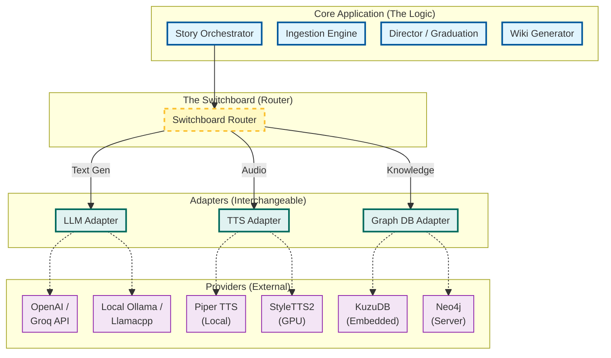
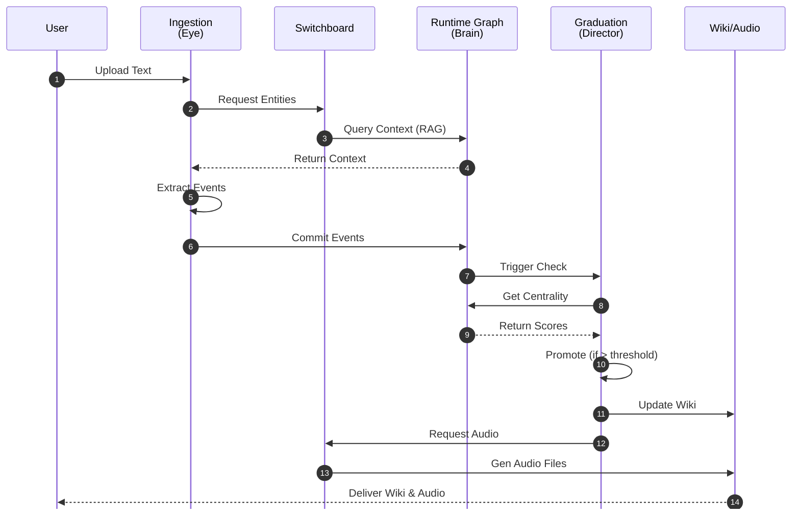

# Webnovel Architect: Detailed Architecture & User Pipeline

**Version:** 1.0  
**Date:** 2026-02-09  
**Status:** Architecture Definition

---

## 1. Executive Summary

The **Webnovel Architect** is a **Neuro-Symbolic Story Intelligence System** designed to function on consumer hardware ("Zero-GPU"). It evolves static text into a living, queryable world.

The system relies on two core architectural innovations:
1.  **The Switchboard Pattern (Zero-GPU Architecture):** A modular adapter system that allows heavy AI components (LLM, TTS, Database) to be swapped based on available hardware (e.g., swapping OpenAI API for a local quantized Llama model).
2.  **DyG-RAG (Dynamic Graph RAG):** A narrative memory system that builds a knowledge graph *as the story progresses*, allowing for accurate retrieval of past events and character relationships.

---

## 2. High-Level Architecture: The "Switchboard"

The core philosophy is strict separation between **Narrative Logic** (The Application) and **AI Compute** (The Provider). The "Switchboard" acts as the central router, connecting the logic to the best available tool for the job.

### 2.1 Component Diagram

### 2.2 Visual Prompts for Presentation

*Figure 1: Modular 'Zero-GPU' Architecture - A central Switchboard connecting interchangeable AI providers.*

---

## 3. End-to-End User Pipeline

The user pipeline transforms a raw text file (chapter) into a fully realized audio drama experience with a supporting wiki.

### 3.1 Pipeline Stages

1.  **Ingestion ("The Eye")**: Reading text, identifying entities, and extracting "Candidate Events".
2.  **Graph Construction ("The Brain")**: Inserting events into the KuzuDB graph and linking them to existing characters.
3.  **Reasoning ("The Director")**: Running PageRank/Centrality algorithms to decide which characters are important enough to get a unique voice ("Graduation").
4.  **Synthesis ("The Voice" & "Memory")**: Generating the Wiki pages and synthesizing Audio for the graduated characters.

### 3.2 Sequence Diagram

### 3.3 Visual Prompts for Presentation

*Figure 2: The Neuro-Symbolic Pipeline - From raw text input to multi-modal output (Wiki & Audio).*

---

## 4. Subsystem Details

### 4.1 Ingestion Engine ("The Eye")
*   **Goal:** Turn unstructured text into structured data.
*   **Laptop Mode:** Uses Regex and spaCy (runs on CPU).
*   **Zero-GPU Mode:** Uses remote APIs (Groq/OpenAI) via Switchboard for high-accuracy extraction without local hardware.
*   **Research Mode:** Uses local Llama-3 for maximum privacy and control.

*Figure 3: Ingestion Engine ("The Eye") - Scanning text to extract entities with confidence scores.*

### 4.2 Dynamic Graph Runtime ("The Brain")
*   **Goal:** Remember everything.
*   **Tech:** KuzuDB (Embedded, default) or Neo4j (Server, visualization).
*   **Data Model:** `(Character)-[PARTICIPATED_IN]->(Event)-[NEXT]->(Event)`.

*Figure 4: Dynamic Graph Runtime ("The Brain") - 3D network graph representing narrative memory.*

### 4.3 Graduation System ("The Director")
*   **Goal:** Resource allocation defined by narrative importance.
*   **Algorithm:** 
    *   *Background Characters* = No Voice (Text only).
    *   *Supporting Characters* = Standard Voice (Piper/Edge-TTS).
    *   *Main Cast* = High Quality Voice (StyleTTS2/XTTS).
*   **Logic:** As a character's "Centrality" (connections) increases in the graph, they "Graduate" tiers.

---

## 5. Technology Stack & Deployment Tiers

The system supports three distinct hardware profiles via the Switchboard.

| Tier | Extraction Strategy | Runtime Memory | Audio Synthesis |
| :--- | :--- | :--- | :--- |
| **Research Lab** *(High-End GPU)* | **xCore / Llama-3 (FP16)** Local, high-precision extraction. | **Neo4j Enterprise** Visual, server-based graph. | **StyleTTS2 / XTTS** Studio-quality voice (requires VRAM). |
| **Laptop** *(Consumer CPU)* | **spaCy** Fast, rule-based extraction. | **KuzuDB** Embedded, local graph file. | **Piper (ONNX)** Fast, medium-quality offline TTS. |
| **Zero-GPU** *(Cloud Dependent)* | **LLM API (OpenAI/Groq)** Offloaded intelligence. | **KuzuDB** Embedded, local graph file. | **Edge-TTS / API** Cloud-based synthesis. |
