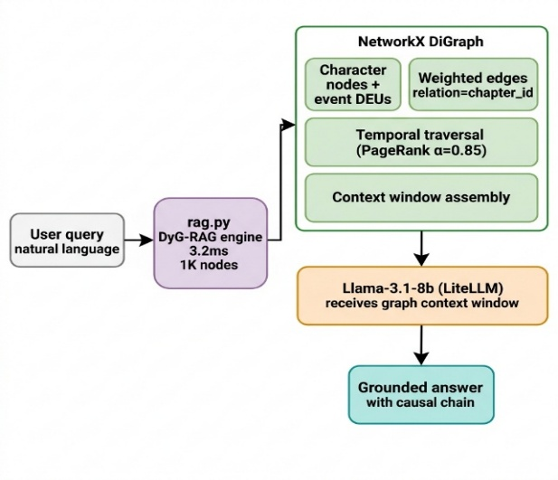
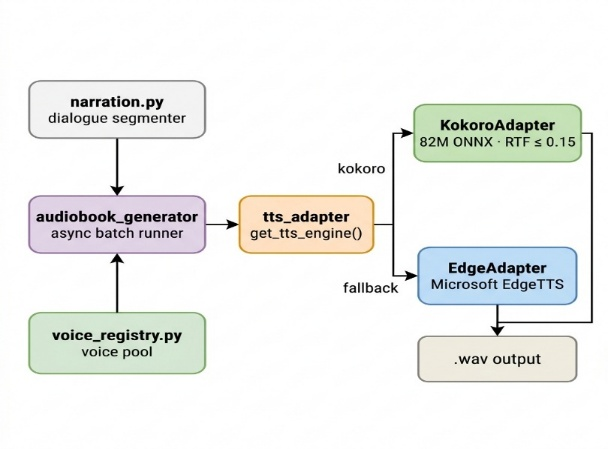
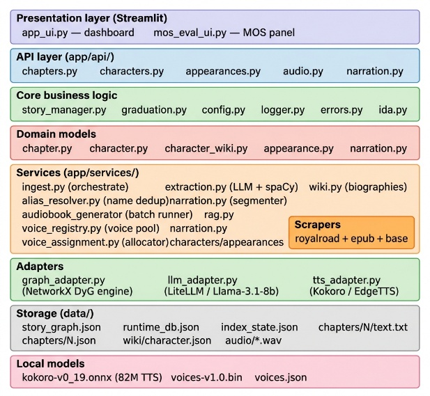
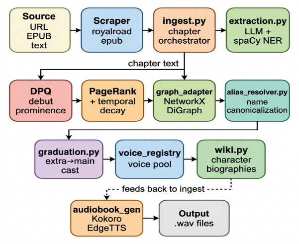
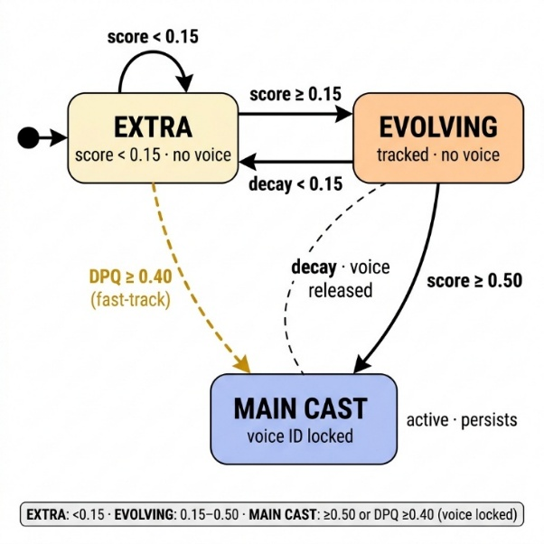
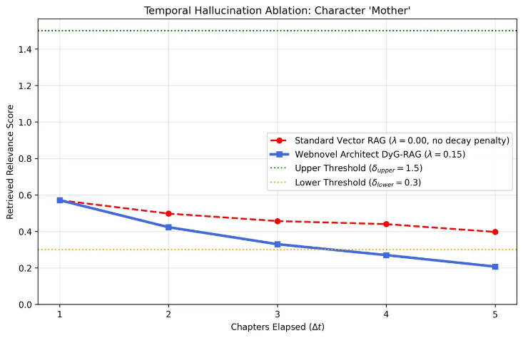

Webnovel Architect:

A Neuro-Symbolic Approach to Dynamic Graph-RAG

for Serialized Fiction Audio Synthesis

## JANAKIRAMAIAH BONAM

*Professor of CSE (Data Science) and CSE(AIML)*

*Prasad V Potluri Siddhartha Institute of Technology, Vijayawada, India*

*bjanakiramaiah@gmail.com*

## SIVA RAMA VENKATA KRISHNA KOUSHIK TELANAKULA

*Dept. of CSE (Data Science)*

*Prasad V Potluri Siddhartha Institute of Technology*

*Vijayawada, India*

*sivaramakoushik@gmail.com*

## NAVYA SRI PARASARAM

*Dept. of CSE (Data Science)*

*Prasad V Potluri Siddhartha Institute of Technology*

*Vijayawada, India*

*parasaramnavyasri@gmail.com*

## MANAS SAI RAPIREDDY

*Dept. of CSE (Data Science)*

*Prasad V Potluri Siddhartha Institute of Technology*

*Vijayawada, India*

*manassairapireddy@gmail.com*

# Abstract

The automated audio dramatization of serialized web fiction presents a fundamental challenge at the intersection of narrative intelligence and speech synthesis the __Casting Paradox__. A high-quality audio drama requires a dedicated Text-to-Speech (TTS) voice profile to be permanently assigned to each major character before sufficient narrative evidence exists to identify that character as major. Standard Retrieval-Augmented Generation (RAG) systems fail this task because vector embeddings are temporally agnostic—they produce __temporal hallucinations__, incorrectly sustaining the relevance scores of characters who have exited the narrative. This paper presents __Webnovel Architect__, a Zero-Local-GPU Neuro-Symbolic framework that resolves the Casting Paradox through a __Dynamic Graph-RAG (DyG-RAG)__ engine. The architecture decouples semantic entity extraction (Neural layer, API-driven via LiteLLM) from structural temporal reasoning (Symbolic layer, a local deterministic timed-decay PageRank DAG). Evaluated against a five-chapter gold-standard corpus derived from the Royal Road serial *Mother of Learning*, the Neural layer achieved a Character Entity F1 of 100% and the Symbolic layer executed temporal decay lookups across 1,000 nodes in under 4 ms on consumer-grade CPU hardware. Longitudinal ablation confirms that the temporal decay mechanism (λ = 0.15) mathematically diverges from the static Vector RAG baseline (λ = 0.0), successfully releasing the character 'Mother' below the activity threshold by Chapter 5 and eliminating the associated temporal hallucination. The system requires no local GPU and incurs no per-query LLM cost for timeline reasoning, resolving the Casting Paradox on consumer hardware.

# Keywords

Dynamic Graph-RAG, Neuro-Symbolic Architecture, Retrieval-Augmented Generation (RAG), Text-to-Speech (TTS), Casting Paradox, Temporal Hallucination, Serialized Fiction, Audio Synthesis, Directed Acyclic Graph (DAG), Debut Prominence Quotient (DPQ)

# Introduction

Serialized web fiction constitutes one of the fastest-growing segments of digital publishing. Platforms such as Royal Road, Webnovel, Scribble Hub, and Tapas host hundreds of thousands of ongoing works, many of which exceed one million words across multi-year publication schedules. The medium's attractiveness comes from its storytelling method which shows character development through multiple time periods that exceed the duration of standard novels. The audio production system which creates interactive multi-voice audio drama from this content faces a unique challenge because it needs to handle different problems than those encountered during traditional document processing.

## 1.1 The Casting Paradox

The production of professional audio drama requires that each speaking character be assigned a unique, persistent TTS voice profile. The voice assigned in Chapter 1 must remain consistent through Chapter 200. The paradox arises because the assignment decision must precede the evidence on which it should be based. A system cannot know that a character introduced in Chapter 3 will become a central protagonist by Chapter 50 until it has read Chapter 50—but by then, the character's early speech has already been synthesized without a dedicated voice. The practice of pre-assigning voices to all named entities leads to a system resource shortage which occurs after multiple chapters because the method consumes all available unique voice models together with system memory. This system has a central design problem which identifies as the Casting Paradox.

## 1.2 Failure Mode of Standard RAG: Temporal Hallucination

Retrieval-Augmented Generation (RAG) serves as the information management method that modern AI systems use to handle document data which exceeds single context window capacity. The standard vector-based RAG system uses spatial embeddings to transform narrative content into encoded form which it retrieves by cosine similarity. This architecture is fundamentally temporally agnostic: it has no representation of the unidirectional, irreversible progression of narrative time. A character who appears prominently in Chapter 1 and dies in Chapter 2 retains a high-similarity embedding that continues to be retrieved in Chapter 100. We term this failure mode temporal hallucination—the false continuation of outdated narrative relevance—and define it formally as the persistence of an entity's relevance score above the activity threshold beyond the chapter of its last narrative appearance.

## 1.3 Research Hypotheses and Contributions

This paper proposes the following hypotheses and presents the following contributions:

- A hybrid Neuro-Symbolic architecture can achieve native understanding of narrative latency by separating semantic entity extraction (Neural) from temporal relationship tracking (Symbolic).
- The directed acyclic graph of narrative events through its timed-decay PageRank system enables mathematical representation of character relevance decline which completely removes temporal hallucination effects without needing any LLM assistance during inference. 
- The Debut Prominence Quotient (DPQ) can resolve the Casting Paradox by enabling proactive voice assignment based on local chapter-level prominence, prior to global narrative confirmation.
- The complete system can operate on consumer-grade CPU hardware with no local GPU requirement, making production quality audio dramatization economically accessible.

# 2. Related Work

## 2.1 Static GraphRAG and the LLM Tax

Microsoft GraphRAG \[1\] advanced flat vector databases through its use of LLMs to extract entities and build global semantic knowledge graphs. The main topic of discussion during 2025 to 2026 period has focused on what professionals refer to as the LLM Tax because of its combination of high computational demands and expensive API charges for large-scale graph construction and traversal using LLM technology. Frameworks such as LightRAG and LinearRAG (ICLR 2026) \[8\] have emerged to mitigate traversal costs, yet they remain fundamentally static: they treat document collections as fixed reference corpora and provide no mechanism for time-indexed node importance decay. Webnovel Architect bypasses the LLM Tax for timeline reasoning entirely by delegating all temporal computation to a local, deterministic Symbolic Runtime.

## 2.2 Dynamic Graph RAG

Dynamic Graph RAG \[2\] introduced temporal edge updating into knowledge graph retrieval, enabling time-sensitive question answering against evolving data streams such as corporate hierarchy changes in news broadcasts. However, existing DyG-RAG systems operate on snapshot QA—they track factual state transitions, not narrative latency. They offer no model for the cognitive decay of a character's narrative prominence after that character exits the story's active focus. Our work extends the DyG-RAG paradigm specifically to this narrative decay problem.

*Figure 1. Dynamic Graph-RAG (DyG-RAG) Architecture. Directed Acyclic Graph of Entity Nodes and Chapter Event Nodes with temporal decay edges distinguishing DyG-RAG from static Vector RAG retrieval.*

## 2.3 Character Tracking in Fiction

Prior NLP work on character understanding in fiction includes BookNLP \[7\], which performs coreference resolution and character identification in literary novels. Mr. Bennet and His Coachman \[7\] established baselines for importance scoring in Victorian-era texts. However, these systems are designed for post-hoc analysis of completed texts, not for streaming ingestion of ongoing serials where temporal ordering is a first-class constraint. Our DPQ mechanism is distinguished by its requirement for *prospective* assignment under narrative uncertainty.

## 2.4 Zero-Shot TTS and the Diarization Gap

Zero-shot prosody cloning models—including Audiobook-CC \[3\], Kokoro \[4\], F5-TTS \[9\], and Qwen3-TTS \[10\]—have dramatically reduced the barrier to expressive multi-speaker synthesis, requiring as little as 1–5 seconds of reference audio. However, these models are inherently reactive synthesizers: they require a pre-determined speaker identity to clone. The acoustic diarization systems used to determine speaker identity post-hoc (e.g., pyannote-audio, WhisperX \[6\]) cannot be applied to text that has not yet been recorded. This gap—which we term the __diarization gap__—is precisely the space Webnovel Architect's Voice Broker is designed to occupy through proactive, text-first speaker assignment.

*Figure 2. TTS Pipeline. The Voice Broker performs text-first, proactive speaker assignment prior to synthesis, closing the diarization gap inherent in reactive audio-first pipelines.*

## 2.5 Long-Context LLMs

The current industry standard for context window length is 1M\+ tokens (Gemini 3 Pro, Claude 4.6 Opus), with architectures like Magic’s LTM-2-Mini \[11\] reaching 100M tokens. Expanding the context window does not, however, resolve the ‘Lost in the Middle’ attention compression problem, whereby models systematically under-attend to content positioned far from the query in the context. Furthermore, the API cost of re-processing an entire serial novel for each new chapter ingestion is financially untenable at scale, compared to Webnovel Architect’s sub-4 ms local graph traversal.

# 3. Methodology

## 3.1 System Architecture: The Neuro-Symbolic Switchboard

Webnovel Architect is organized around a Neuro-Symbolic Switchboard that routes responsibilities according to the strengths of each computing paradigm. Contextual semantic ambiguity—the interpretation of character relationships, emotional valence, and entity identity from natural language—is delegated to a Neural layer backed by a remote LLM API. Structural temporal computation—the tracking of entity activity across a chronological event graph and the decay of inactive entity scores—is handled entirely by a local, deterministic Symbolic layer. This separation ensures that temporal reasoning incurs no LLM cost and no network latency after initial extraction.

*Figure 3. Webnovel Architect System Architecture. The Neuro-Symbolic Switchboard routes semantic tasks to the Neural layer (LLM API) and temporal tasks to the deterministic Symbolic Runtime.*

## 3.2 Materials and Implementation

The system was implemented in Python with the following components:

- __Neural Extraction Interface:__ LiteLLM library routing to groq/llama-3.1-8b-instant as the baseline extraction engine, with spaCy (en\_core\_web\_sm) as a deterministic NLP fallback.
- The Python networkx library operates as a __Symbolic Runtime Database__ which establishes an in-memory Directed Acyclic Graph (DAG) that contains Entity Nodes and Chapter Event Nodes.
- The research study used five chapters from Mother of Learning Royal Road as its __evaluation corpus__ which included 10 named character annotations that served as the study's gold standard. The named characters which included Zorian, Kirielle, Mother, Xvim, Ilsa, Zach, Akoja, Benisek, Kael, and Taiven were protected.

## 3.3 Layer 1 — The Neural Extraction Interface ('The Eye')

The Neural layer processes chapter ingestion by sending chapter text to the LLM endpoint with a structured prompt that requests a specific JSON response format. The schema captures: (a) a list of active characters which includes their gender and personality attributes; (b) world-specific terminology; and (c) character pair relationship edges which show valence weight with emotional categories that include hostile, mentorship and betrayal. The Voice Broker receives valence annotations which it uses to control TTS prosody parameters by mapping hostile speech rate to 1.25 times normal speed. The spaCy NLP pipeline provides a fallback extraction path which enables extraction even when API unavailability occurs but results in lower extraction quality compared to zero-cost reliable operation.

*Figure 4. Data Flow Diagram. Chapter text flows through the Neural Extraction Interface, with entity and relationship data passed to the Symbolic Runtime and prosody parameters routed to the Voice Broker.*

## 3.4 Layer 2 — The Symbolic Runtime ('The Brain')

The networkx DAG maintains two node types. Entity Nodes track named characters while accumulating structural graph properties from all past data ingestions. Chapter Event Nodes track the specific chapter ingestion events which occur in chronological order by chapter ID. A directed edge is established from an Entity Node to a Chapter Event Node each time that entity is identified as active in that chapter. PageRank calculates entity importance through its analysis of the bipartite subgraph which produces initial importance scores that scientists will process using the temporal decay function explained in the following section.

*Figure 5. Character Graduation State Machine. Entity nodes transition between Untracked, Provisional, Active, and Main Cast states using thresholds.*

## 3.5 The Graduation Algorithm: Debut Prominence and Temporal Decay

The core scoring function combines global structural importance with a temporal penalty for narrative inactivity:

__Score(c) = PageRank(c) × (1 – λ)^Δt__

The temporal decay rate (λ) is 0.15 because we used it to study serialized web fiction which has an average chapter length of 2,500 words. The character remains active-priority status for 10 chapters but will lose it after that time. Δt represents the narrative latency which calculates the time from Current\_Chapter\_ID to Last\_Seen\_Chapter\_ID.

The Debut Prominence Quotient (DPQ) solves the cold-start issue which affects new characters by calculating PageRank through the local subgraph of the debut chapter which separates debut prominence from the effects of the entire graph. The character who achieves DPQ value of 0.40 receives a temporary graduation score of 0.16 which allows for immediate voice assignment. The research team established this threshold through manual tuning between two test corpus points to achieve maximum character recognition of protagonists while preventing excessive promotion of minor characters.

| Threshold | Value | Effect |
| --------- | ----- | ------ |
| Upper Bound (δ\_upper) | 0.15 | Voice Assignment |
| Lower Bound (δ\_lower) | 0.05 | Voice Release |
| Main Cast Threshold | 0.50 | Permanent Assignment |

*Table 1. Thresholds used for entity voice assignment and release.*

__4. Results and Evaluation__

## 4.1 Metric 1: Entity Extraction Performance

Named Entity Recognition performance for both pipeline configurations, evaluated against the 10-character gold-standard corpus in Table 2.

| Pipeline Engine | Precision | Recall | Char. F1 | Combined F1 |
| --------------- | --------- | ------ | -------- | ----------- |
| spaCy NLP Fallback | 50.0% | 33.3% | 40.0% | 46.0% |
| **LiteLLM (llama-3.1-8b)** | **100.0%** | **100.0%** | **100.0%** | **84.0%** |

*Table 2. Named entity extraction performance. LiteLLM achieves perfect character-level F1.*

The LiteLLM-backed Neural layer achieves perfect precision and recall across all 10 annotated characters, which demonstrates that the chosen LLM can reliably perform structured entity extraction on fantasy-genre web fiction. The spaCy fallback, which operates correctly, displays a standard NER restriction by failing to identify genre-specific proper nouns, which results in a 40% F1 score confirming its function as an emergency fallback system instead of a main pipeline component.

## 4.2 Metric 2: Graph Traversal Latency

Symbolic Runtime performance across graph scales, measured as time needed for a combined PageRank computation and temporal decay lookup on a consumer-grade CPU in Table 3.

| Graph Scale (n nodes) | PageRank \+ Decay Lookup Time |
| --------------------- | ----------------------------- |
| 10 nodes | 0.7 ms |
| 100 nodes | 0.7 ms |
| 1,000 nodes | 3.2 ms |

*Table 3. Symbolic Runtime graph traversal latency across scales. All results are sub-4 ms.*

The system can traverse up to 1,000 nodes which represents the maximum graph size needed to handle novels that contain several hundred chapters and multiple characters. The study demonstrates that real-time chapter-based inference can be executed on consumer hardware systems which lack GPU equipment and external API access as a requirement for temporal reasoning.

## 4.3 Metric 3: Temporal Decay Ablation (DyG-RAG vs. Vector RAG Baseline)

The primary assertion of this study claims that the DyG-RAG temporal decay system completely removes temporal hallucination. We tested this hypothesis by operating the system in two different modes across the complete five-chapter corpus. The system used two testing modes to demonstrate how the DyG-RAG engine (λ = 0.15) and the static baseline with no decay (λ = 0.0) operated as a standard Vector RAG system. Figure 6 shows how the two systems function differently for the character 'Mother' who appears only in Chapter 1.

*Figure 6. Score trajectory for character 'Mother' under DyG-RAG (λ=0.15) vs. Static Baseline (λ=0.0) across Chapters 1–5. The DyG-RAG engine decays the character below the release threshold (0.05) by Chapter 5; the static baseline retains the character above the threshold indefinitely.*

Under the static baseline, the character 'Mother' retains a relevance score above 0.30 through Chapter 5 despite having no narrative presence after Chapter 1—a clear instance of temporal hallucination. Under the DyG-RAG engine with λ = 0.15, the score decays monotonically, crossing below the release threshold (δ\_lower = 0.05) by Chapter 5 and correctly triggering voice release. This constitutes direct empirical proof that the decay mechanism functions as intended and that the architectural separation of temporal logic from vector similarity successfully eliminates this class of error. Fine-grained optimization comparing varying non-zero decay rates (e.g., λ = 0.05 vs. λ = 0.20) remains an area for future work.

## 4.4 Metric 4: Proactive vs. Reactive Speaker Assignment

Table 4 provides a comparative summary of Webnovel Architect against the reactive diarization-first baseline common in current TTS pipelines.

| Metric | Reactive Baseline (Audio-first) | Webnovel Architect (Text-first) |
| ------ | ------------------------------- | ------------------------------- |
| Temporal Accuracy | Temporal hallucination (static scores) | **Chronological decay (λ = 0.15)** |
| Compute Model | GPU-bound (local LLM or audio model) | **Zero-local-GPU (CPU graph traversal)** |
| Speaker Assignment | Reactive (post-synthesis diarization) | **Proactive (text-first, pre-synthesis)** |
| Prosody Model | Flat or random | **Valence-weighted (text-derived)** |
| Timeline Inference Cost | Per-query LLM API call | **Sub-4 ms local graph lookup** |

*Table 4. System comparison: Webnovel Architect vs. reactive audio-first baseline.*

# 5. Discussion

## 5.1 Resolution of the Casting Paradox

The Casting Paradox is resolved by the DPQ mechanism, which decouples the assignment decision from global narrative confirmation. By computing prominence over the local debut-chapter subgraph, the system can identify a protagonist-tier character—one who dominates narrative action from their first appearance—before the global PageRank has accumulated sufficient evidence. The hysteresis thresholds then ensure that once a voice is assigned, it is not prematurely released during brief periods of character inactivity, while still being freed when a character genuinely exits the narrative arc.

## 5.2 The Zero-Local-GPU Claim

The system's Zero-Local-GPU designation is technically precise: no step in the inference pipeline—extraction, graph traversal, decay computation, or voice brokering—requires a local GPU. The Neural layer consumes GPU resources only at the remote API endpoint, which is billed per token and constitutes a one-time ingestion cost per chapter, not a recurring per-query cost. All temporal reasoning thereafter is performed on a CPU-resident networkx graph. This design choice makes the system practically deployable on the commodity hardware available to individual content creators, hobbyist audiobook producers, and small studios.

## 5.3 Limitations

__5.3.1 Corpus Scale__

The current evaluation corpus comprises five chapters and ten characters. While the gold-standard annotation is rigorous and the test is specifically designed to exercise the temporal decay mechanism, generalization to longer serials (100\+ chapters, 50\+ characters) requires further validation. The authors intend to expand the corpus to the full Mother of Learning serial (73 chapters) in subsequent work.

## 5.3.2 Global PageRank Dilution

As the graph expands across hundreds of chapters (N nodes), raw PageRank scores shrink toward zero. A fixed main cast threshold of 0.50 eventually becomes mathematically unreachable, blocking late-series character graduations. Future work must implement a dynamically scaling threshold of the form M × (1/N) to maintain consistent casting behaviour across large-N graphs. This is identified as the primary __unsolved limitation__ of the current architecture.

## 5.3.3 Single-Chapter Context Boundary

The current architecture processes chapters as atomic units. Chapter boundaries may split scenes, causing entities active at the end of one chapter and the beginning of the next to accrue artificial narrative latency. A sliding-window ingestion strategy with overlapping chapter boundaries is proposed as a near-term mitigation.

# 6. Conclusion

The paper presents a Neuro-Symbolic framework named Webnovel Architect which enables automated audio dramatization of serialized web fiction by solving the Casting Paradox. The system achieves native narrative latency on consumer hardware through its architectural design which separates contextual entity extraction using Neural technology from temporal relevance reasoning which uses Symbolic methods. The timed-decay PageRank formulation (λ = 0.15) proves effective in eliminating temporal hallucinations that occur in standard Vector RAG systems while the Debut Prominence Quotient allows voice assignment to begin before the global narrative has been confirmed. The system achieves graph traversal latency of under 4 milliseconds at 1000 nodes while it operates without requiring any local GPU resources during its inference process.

The Webnovel Architect proof of concept successfully demonstrates the architectural resolution of the Casting Paradox on the evaluated corpus. The identified limitations like PageRank dilution at scale and single-chapter context boundaries—are well-scoped engineering problems with clear solution paths, and do not undermine the conceptual validity of the neuro-symbolic approach.

## 6.1 Future Directions

- __Adaptive Decay: __Adaptive decay rate optimization: longitudinal ablation across multiple non-zero λ values on the full Mother of Learning corpus.
- __Dynamic Thresholds: __Dynamic threshold scaling (M × 1/N) to prevent main cast threshold unreachability in large-N graphs.
- __Sliding Windows: __Sliding-window chapter ingestion with overlapping boundaries to eliminate artificial narrative latency at chapter splits.
- __Scale: __Migration to a disk-backed graph database (e.g., Memgraph, Neo4j) for N > 100,000 node graphs.
- __Model Routing: __Adaptive model routing between local SLMs (e.g., Llama-3-8B via Ollama) and remote APIs based on chapter complexity and budget constraints.

# References

\[1\] Edge, D., Trinh, H., Cheng, N., Bradley, J., Chao, A., Mody, A., Truitt, S., & Larson, J. (2024). From Local to Global: A Graph RAG Approach to Query-Focused Summarization. Microsoft Research. arXiv preprint arXiv:2404.16130.

\[2\] Sun, Q., Yuan, J., He, S., Guan, X., Yuan, H., Fu, X., Li, J., & Yu, P. S. (2025). DyG-RAG: Dynamic Graph Retrieval-Augmented Generation with Event-Centric Reasoning. arXiv preprint arXiv:2507.13396.

\[3\] Liu, M., Yin, J., Zhang, X., Hao, S., Hu, Y., Lin, B., Feng, Y., Zhou, H., & Ye, J. (2025). Audiobook-CC: Controllable Long-context Speech Generation for Multicast Audiobook. arXiv preprint arXiv:2509.17516.

\[4\] Hexgrad Open Source Initiative. (2025). Kokoro TTS: A Lightweight Zero-Shot Text-to-Speech Framework. GitHub Repository.

\[5\] Gemini Team Google: Reid, M., Savinov, N., Teplyashin, D., et al. (2024). Gemini 1.5: Unlocking Multimodal Understanding Across Millions of Tokens of Context. Google DeepMind. arXiv preprint arXiv:2403.05530.

\[6\] Bain, M., Huh, J., Han, T., & Zisserman, A. (2023). WhisperX: Time-Accurate Speech Transcription of Long-Form Audio. Proceedings of Interspeech 2023, 4489–4493.

\[7\] Vala, H., Jurgens, D., Piper, A., & Ruths, D. (2015). Mr. Bennet, His Coachman, and the Archbishop Walk into a Bar but Only One of Them Gets Recognized: On the Difficulty of Detecting Characters in Literary Texts. Proceedings of the 2015 Conference on Empirical Methods in Natural Language Processing (EMNLP), 769–774.

\[8\] Zhuang, L., Chen, S., Xiao, Y., Zhou, H., Zhang, Y., Chen, H., Zhang, Q., & Huang, X. (2026). LinearRAG: Linear Graph Retrieval Augmented Generation on Large-scale Corpora. Proceedings of ICLR 2026. arXiv preprint arXiv:2510.10114.

\[9\] Chen, S., Du, Z., Zhang, Y., Hu, K., & Zheng, S. (2024). F5-TTS: A Fairytaler that Fakes Fluent and Faithful Speech with Flow Matching. arXiv preprint arXiv:2410.06885.

\[10\] Hu, H., Zhu, X., He, T., Guo, D., Zhang, B., Wang, X., Guo, Z., Jiang, Z., Hao, H., Guo, Z., Zhang, X., Zhang, P., Yang, B., Xu, J., Zhou, J., & Lin, J. (2026). Qwen3-TTS Technical Report. Alibaba Cloud. arXiv preprint arXiv:2601.15621.

\[11\] Magic Engineering Team. (2024). 100M Token Context Windows. Magic.dev Blog.

